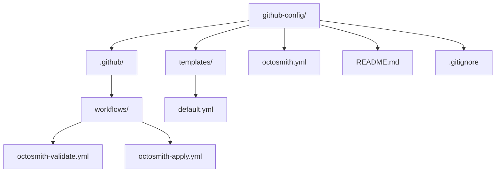

# OctoSmith

Declarative desired-state management for GitHub repositories.

OctoSmith lets an organization describe which repositories it manages, assign
each repository to a template, inspect the changes required to reach that
desired state, and apply those changes through the CLI or GitHub Actions.

## Quick start

Create a control repository:

```sh
deno create jsr:@octosmith/octosmith@0 github-config -- --organization acme
```

The generated repository starts deliberately small:



Edit `octosmith.yml` to define the repositories in scope, then edit or add
templates under `templates/` to describe their desired state.

The generated pull-request workflow validates configuration offline without
organization credentials. The default-branch workflow applies the configuration
using the `OCTOSMITH_TOKEN` secret.

For non-interactive scaffolding, options after Deno's `--` separator include:

- `--organization <name>`
- `--collection-management <explicit|strict>`
- `--default-branch <name>`
- `--no-workflows`
- `--event-streaming`

## How OctoSmith works

OctoSmith follows the same pipeline whether it runs locally or in GitHub
Actions:

1. Load and validate the configuration directory.
2. Discover repositories inside `repositories.scope`.
3. Resolve each repository to exactly one matching template.
4. Read the current GitHub state.
5. Build a plan from current state to desired state.
6. Report the plan or apply its operations.

The default collection-management mode is `explicit`: OctoSmith manages only
members explicitly declared by configuration. `strict` makes supported named
collections authoritative and can remove undeclared members.

See the [library package README](packages/octosmith/README.md) for the
configuration model and programmatic API.

## Run OctoSmith

### CLI

Install the CLI:

```sh
deno install -A -n octosmith jsr:@octosmith/cli@0
```

Then validate, plan, or apply:

```sh
octosmith validate --path .
octosmith plan --path .
octosmith apply --path .
```

`plan` and `apply` use `GITHUB_TOKEN`. `validate` is fully offline.

See the [CLI package README](packages/cli/README.md) for command options,
targeted runs, output formats, exit behavior, and event output.

### GitHub Action

The repository also ships a GitHub Action:

```yaml
- uses: Kralizek/octosmith@v0
  with:
    mode: apply
    github-token: ${{ secrets.OCTOSMITH_TOKEN }}
```

Supported modes are `validate`, `plan`, and `apply`. The moving `v0` tag tracks
the latest compatible 0.x Action release.

## Event streaming

The CLI can emit one NDJSON resource event per repository while planning or
applying. The output path can be a normal file, FIFO, or another writable path.

The scaffolder's `--event-streaming` option generates a Hooksmith example that
streams live `resource.applied` events while OctoSmith is running. Hooksmith is
an optional consumer; the OctoSmith library itself does not depend on Hooksmith
for apply behavior.

## Documentation

Detailed documentation lives under [`docs/`](docs/README.md):

- [Getting started](docs/getting-started.md)
- [Configuration](docs/configuration.md)
- [Automation](docs/automation.md)
- [Architecture](docs/architecture.md)
- [Agent guide](docs/agent-guide.md)

## Packages

| Package                                                | Purpose                                                                                                                     |
| ------------------------------------------------------ | --------------------------------------------------------------------------------------------------------------------------- |
| [`@octosmith/octosmith`](packages/octosmith/README.md) | Configuration, desired/current state models, planning, reporting, GitHub integration, and the control-repository scaffolder |
| [`@octosmith/cli`](packages/cli/README.md)             | Command-line interface for validate, plan, apply, reporting, and event output                                               |

## Examples

[`examples/configuration`](examples/configuration) contains a fuller
configuration with repository selectors, repository settings, rulesets,
environments, teams, and managed files.

## Versioning

OctoSmith is currently on the 0.x release line. The public surface is usable,
but configuration and APIs may still evolve before 1.0.
