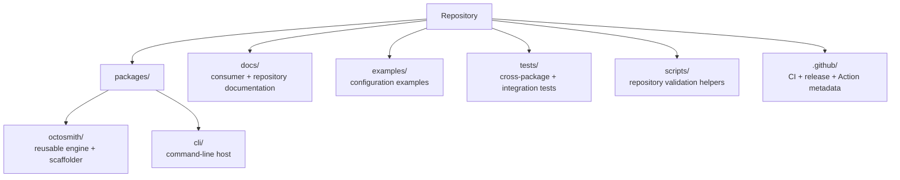

# Agent guide

This document is for coding agents and maintainers making changes in this
repository.

## Repository layout



## Architectural boundaries

Keep these boundaries intact unless the change explicitly intends to redesign
them:

1. `@octosmith/octosmith` must not depend on `@octosmith/cli`.
2. Planning operates on Octosmith state models, not raw GitHub REST payloads.
3. GitHub API calls belong in the GitHub integration layer.
4. Hooksmith integration belongs at CLI/workflow level; the engine remains
   Hooksmith-agnostic.
5. Use the vocabulary `apply`, not `reconcile`.
6. Collection removal is controlled by collection-management semantics.
7. File deletion is always explicit; strict mode does not infer it.
8. Validation must remain safe for untrusted pull-request configuration.

## Common change paths

### Configuration syntax

The canonical JSON schemas live under root `schemas/`. Package-local files under
`packages/octosmith/configuration/schemas/` are generated packaging/runtime
artifacts. They are ignored by Git and materialized from the root schemas by
`deno task sync:schemas` before validation and packaging.

Usually touches:

- `packages/octosmith/configuration/`
- canonical JSON schemas under `schemas/`
- normalization / desired-state resolution
- validation tests
- docs/configuration.md

### New managed GitHub resource

Usually touches:

- current and desired state models
- GitHub state source
- planner operation types and build logic
- mutation sink
- report mapping
- focused tests for read / plan / apply

Do not add a planner operation without a corresponding apply path.

### CLI behavior

Keep argument parsing and presentation in `packages/cli`. Reusable state or
planning behavior belongs in the engine.

### Scaffolder

Generated files are templates under `packages/octosmith/create/templates`. Keep
generated workflows thin; substantial shell logic should live in generated
script files rather than large YAML blocks.

### JSON schemas

The canonical JSON schemas live under `schemas/`. The package-local copies under
`packages/octosmith/configuration/schemas/` are generated and ignored by Git;
they exist only because the published library imports schemas relative to its
package root.

Do not edit generated copies. `deno task check` runs `sync:schemas` first, and
the release workflow synchronizes again before package validation and publish.

### Release workflow

Shell-heavy workflow logic should live under `.github/workflows/scripts`.

## Public API documentation

Every directly exported class, interface, type, enum, function, or variable under
`packages/` must have JSDoc. CI enforces this with `deno task check:docs`.

When adding a public declaration, document its purpose at the declaration rather
than relying on a README to explain it.

## CI expectations

Before considering a change complete:

```sh
deno task check
```

The check includes formatting, linting, exported API documentation validation,
and tests.

After pushing, verify the expected GitHub Actions CI run appears and completes
successfully.

## Documentation ownership

- root README: project landing page and onboarding
- package READMEs: package-specific entry points
- `docs/`: detailed cross-surface consumer and architecture documentation
- this file: agent/maintainer repository guidance

Prefer linking to canonical documentation over duplicating paragraphs across
multiple READMEs.
