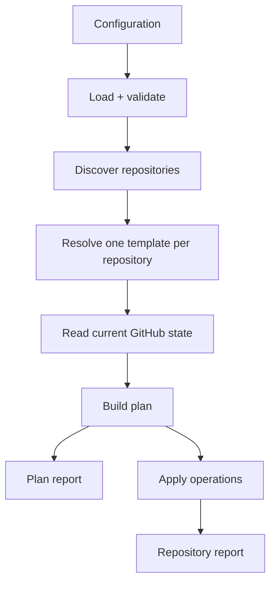

# Architecture

Octosmith separates configuration and planning from command-line hosting and
GitHub transport concerns.

## Packages

### @octosmith/octosmith

The reusable engine:

- configuration loading and validation
- repository selectors and template resolution
- desired/current state models
- plan construction
- reporting
- GitHub discovery and state readers
- mutation sinks and apply helpers
- control-repository scaffolder

### @octosmith/cli

The host:

- command parsing
- validate / plan / apply orchestration
- output format selection
- GitHub runtime construction
- event serialization and output
- process exit behavior

The library must not depend on the CLI.

## Execution flow



Plan and apply share discovery, state loading, desired-state resolution, and
planning. Apply differs only after a plan exists.

`resource list` stops after discovery and template classification. Discovery
applies configuration-scope include/exclude evaluation before classification.
The canonical `classifyResource` primitive is shared by inspection,
desired-state resolution, fresh apply preparation/recheck, and persisted-plan
preflight. It distinguishes a single match, no match, and invalid multiple
matches without resolving runtime values or reading managed files.

## Desired state and current state

Configuration is normalized into desired state before planning. GitHub adapters
load current state into a separate model. The planner compares the two and emits
typed operations.

This keeps GitHub REST shapes out of planning logic.

## Collection semantics

Collection management belongs to desired-state interpretation, not GitHub API
transport.

`explicit` preserves undeclared members. `strict` may remove undeclared members
for supported named collections.

## GitHub integration

The GitHub layer is split around interfaces:

- discovery finds repositories in configured scope
- state sources read current repository state
- mutation sinks translate operations into GitHub API calls

This keeps the planner testable without GitHub.

## Persisted executable plans

Fresh and persisted apply share an executable-resource boundary that prepares
all resources before mutation and rechecks selection and state before each
resource executes. A saved plan adds configuration, template, and state hash
preconditions: after preflight, Octosmith must replay the stored operations
rather than reinterpret them from live state.

Resource state preconditions therefore combine two independent projections:

- **planning ownership** — remote state that influenced `buildPlan` under the
  effective template and collection-management semantics;
- **replay dependencies** — live state that the exact stored operations will
  read or preserve while the mutation sink executes them.

Replay dependencies are declared by an exhaustive operation contract in the
planning package. The same contract also declares runtime secret sources used by
stored operations. Persisted-plan preflight and the mutation sink share that
contract so adding a new operation type requires an explicit dependency
decision.

For ruleset replacements, replay dependencies include the full current payload
of every retained rule, including unknown and newly appearing fields. Removed
rules contribute only their identities, not discarded contents. This avoids
inferring field ownership from equality with the saved replacement. Create and
update artifacts share ref/push rule schemas; known fields remain validated,
while rule payloads and nested helper objects allow preserved extension fields.

Executable ruleset updates that specify a target must include a complete,
target-compatible rules payload, even when the template only changes the target
or conditions. The planner materializes retained rules into that payload. The
same schema invariant is enforced during artifact parsing, shared preflight for
all resources, and reusable `applyPlan` execution before any mutation.

Managed-file snapshots record their execution branch separately from the current
repository default branch. Fresh planning reads the desired default branch;
persisted preflight derives the branch from the ordered saved operations. Branch
existence and file expectations are checked before mutation, and delivery is
pinned to that branch. All batched file operations must use one execution
branch. Preconditions include managed paths and their replay SHAs, not unrelated
files or the branch's whole commit history.

The persisted apply boundary is:

```text
parse + schema/semantic validation
→ validate effective configuration/template hashes
→ validate runtime dependencies for stored operations
→ validate planning-owned state + replay dependencies for every resource
→ prepare every resource, including file delivery and secret snapshots
→ re-check one resource immediately before mutation
→ replay stored operations exactly
```

The canonical hash function remains generic. Domain-specific semantic
normalization happens before hashing so the hash layer does not need to know
about Octosmith fields.

The execution boundary is not a GitHub transaction. A remote failure or change
after a recheck can still interrupt execution; file writes retain their
concurrency checks and execution stops on the first failed operation.

## Reporting

Repository reports are structured data first. Text and JSON are presentation
choices made by the CLI.

Resource inspection has its own `matched`/`unmatched` classification,
independent of reconciliation statuses. Fresh plan/apply reports retain this
coverage in `inspection`, and text summaries include its unmatched count.
Ignoring unmatched resources changes failure policy, not their classification or
visibility.

Sensitive runtime values and managed file contents must not leak into reports.

## Events

Event emission is a CLI concern layered on repository reports. The core engine
does not depend on Hooksmith.

## Scaffolding

The scaffolder generates a control repository but does not define a separate
runtime architecture. Generated workflows call the same Action/CLI surfaces that
users can invoke directly.
