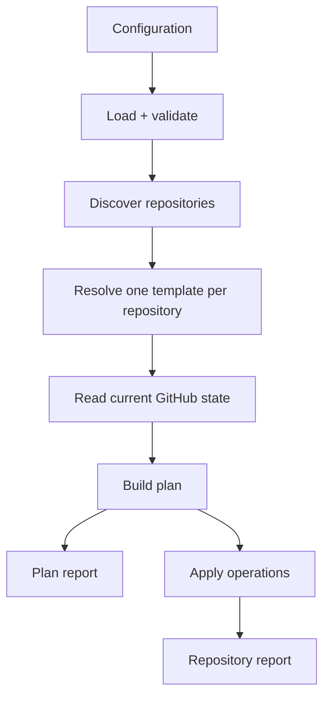

# Architecture

Octosmith separates configuration and planning from command-line hosting and
GitHub transport concerns.

## Packages

### @octosmith/octosmith

The reusable engine:

- configuration loading and validation
- repository selectors and template resolution
- desired/current state models
- plan construction
- reporting
- GitHub discovery and state readers
- mutation sinks and apply helpers
- control-repository scaffolder

### @octosmith/cli

The host:

- command parsing
- validate / plan / apply orchestration
- output format selection
- GitHub runtime construction
- event serialization and output
- process exit behavior

The library must not depend on the CLI.

## Execution flow



Plan and apply share discovery, state loading, desired-state resolution, and
planning. Apply differs only after a plan exists.

## Desired state and current state

Configuration is normalized into desired state before planning. GitHub adapters
load current state into a separate model. The planner compares the two and emits
typed operations.

This keeps GitHub REST shapes out of planning logic.

## Collection semantics

Collection management belongs to desired-state interpretation, not GitHub API
transport.

`explicit` preserves undeclared members. `strict` may remove undeclared members
for supported named collections.

## GitHub integration

The GitHub layer is split around interfaces:

- discovery finds repositories in configured scope
- state sources read current repository state
- mutation sinks translate operations into GitHub API calls

This keeps the planner testable without GitHub.

## Persisted executable plans

Persisted plans add a stricter execution boundary than normal in-process
plan/apply. A saved plan is an executable artifact: after preflight, Octosmith
must replay the stored operations rather than reinterpret them from live state.

Resource state preconditions therefore combine two independent projections:

- **planning ownership** — remote state that influenced `buildPlan` under the
  effective template and collection-management semantics;
- **replay dependencies** — live state that the exact stored operations will
  read or preserve while the mutation sink executes them.

Replay dependencies are declared by an exhaustive operation contract in the
planning package. The same contract also declares runtime secret sources used by
stored operations. Persisted-plan preflight and the mutation sink share that
contract so adding a new operation type requires an explicit dependency
decision.

The persisted apply boundary is:

```text
parse + schema/semantic validation
→ validate effective configuration/template hashes
→ validate runtime dependencies for stored operations
→ validate planning-owned state + replay dependencies for every resource
→ re-check one resource immediately before mutation
→ replay stored operations exactly
```

The canonical hash function remains generic. Domain-specific semantic
normalization happens before hashing so the hash layer does not need to know
about Octosmith fields.

## Reporting

Repository reports are structured data first. Text and JSON are presentation
choices made by the CLI.

Sensitive runtime values and managed file contents must not leak into reports.

## Events

Event emission is a CLI concern layered on repository reports. The core engine
does not depend on Hooksmith.

## Scaffolding

The scaffolder generates a control repository but does not define a separate
runtime architecture. Generated workflows call the same Action/CLI surfaces that
users can invoke directly.
