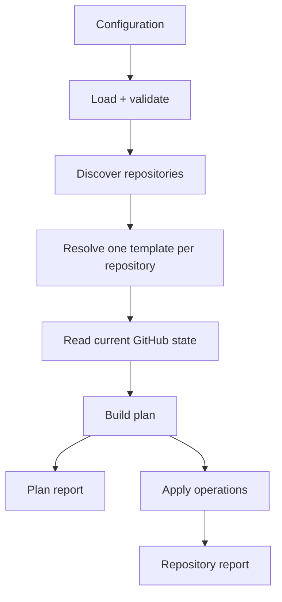

# Architecture

Octosmith separates configuration and planning from command-line hosting and
GitHub transport concerns.

## Packages

### @octosmith/octosmith

The reusable engine:

- configuration loading and validation
- repository selectors and template resolution
- desired/current state models
- plan construction
- reporting
- GitHub discovery and state readers
- mutation sinks and apply helpers
- control-repository scaffolder

### @octosmith/cli

The host:

- command parsing
- validate / plan / apply orchestration
- output format selection
- GitHub runtime construction
- event serialization and output
- process exit behavior

The library must not depend on the CLI.

## Execution flow


```mermaid
flowchart TD
    configuration["Configuration"]
    load["Load + validate"]
    discover["Discover repositories"]
    resolve["Resolve one template per repository"]
    current["Read current GitHub state"]
    plan["Build plan"]
    report["Plan report"]
    apply["Apply operations"]
    repositoryReport["Repository report"]

    configuration --> load --> discover --> resolve --> current --> plan
    plan --> report
    plan --> apply --> repositoryReport
```

Plan and apply share discovery, state loading, desired-state resolution, and
planning. Apply differs only after a plan exists.

`resource list` stops after discovery and template classification. Discovery
applies configuration-scope include/exclude evaluation before classification.
The canonical `classifyResource` primitive is shared by inspection,
desired-state resolution, fresh apply preparation/recheck, and persisted-plan
preflight. It distinguishes a single match, no match, and invalid multiple
matches without resolving runtime values or reading managed files.

## Desired state and current state

Configuration is normalized into desired state before planning. GitHub adapters
load current state into a separate model. The planner compares the two and emits
typed operations.

This keeps GitHub REST shapes out of planning logic.

Runtime preflight distinguishes confirmed missing sources from provider errors.
With `--skip-missing-values`, missing references become explicit reconciliation
exclusions, not empty or placeholder values. Variable normalization validates
destination names before omitting skipped bindings. The engine uses the same
exclusions for planning ownership and reports; environment update operations
also record preserved names so strict cleanup cannot remove skipped values.

## Collection semantics

Collection management belongs to desired-state interpretation, not GitHub API
transport.

`explicit` preserves undeclared members. `strict` may remove undeclared members
for supported named collections.

## GitHub integration

The GitHub layer is split around interfaces:

- discovery finds repositories in configured scope
- state sources read current repository state
- mutation sinks translate operations into GitHub API calls

This keeps the planner testable without GitHub.

## Persisted executable plans

Fresh and persisted apply share an executable-resource boundary that prepares
all resources before mutation and rechecks selection and state before each
resource executes. A saved plan adds configuration, template, and state hash
preconditions: after preflight, Octosmith must replay the stored operations
rather than reinterpret them from live state.

Runtime exclusions are fixed when the plan is created and persisted with each
resource. Replay restores those exclusions and warnings without resolving their
sources, and requires only the secret sources used by stored operations. It
never filters operations based on the applying machine's runtime availability.
Artifact creation and replay use the same excluded desired-state projection;
empty strict collections remain managed so unrelated membership drift is still
detected even when every declared value was skipped.

Resource state preconditions therefore combine two independent projections:

- **planning ownership** — remote state that influenced `buildPlan` under the
  effective template and collection-management semantics;
- **replay dependencies** — live state that the exact stored operations will
  read or preserve while the mutation sink executes them.

Replay dependencies are declared by an exhaustive operation contract in the
planning package. The same contract also declares runtime secret sources used by
stored operations. Persisted-plan preflight and the mutation sink share that
contract so adding a new operation type requires an explicit dependency
decision.

For ruleset replacements, replay dependencies include the full current payload
of every retained rule, including unknown and newly appearing fields. Removed
rules contribute only their identities, not discarded contents. This avoids
inferring field ownership from equality with the saved replacement. Create and
update artifacts share ref/push rule schemas; known fields remain validated,
while rule payloads and nested helper objects allow preserved extension fields.

Executable ruleset updates that specify a target must include a complete,
target-compatible rules payload, even when the template only changes the target
or conditions. The planner materializes retained rules into that payload. The
same schema invariant is enforced during artifact parsing, shared preflight for
all resources, and reusable `applyPlan` execution before any mutation.

Managed-file snapshots record their execution branch separately from the current
repository default branch. Fresh planning reads the desired default branch;
persisted preflight derives the branch from the ordered saved operations. Branch
existence and file expectations are checked before mutation, and delivery is
pinned to that branch. All batched file operations must use one execution
branch. Direct delivery retains managed-path and replay-SHA preconditions.

PR-mode plans additionally carry `managedFiles`: the complete desired file list,
target branch, and immutable target commit SHA. Files are read at that SHA, not
at a moving ref. Even an empty desired list has a snapshot, allowing apply to
close obsolete PRs without introducing lifecycle commands into persisted plans.
Any target advancement invalidates a saved PR-mode plan, including changes to
unmanaged files. Old PR-mode artifacts without this snapshot must be recreated.

The GitHub sink shares the planner's file-delta computation and verifies that
the saved operations equal the complete desired delta. It builds a fresh tree on
the target and uses atomic GraphQL ref updates with expected-old-SHA guards. A
reserved lock ref prevents competing Octosmith executions from changing the
branch while PR metadata or closure is being reconciled. The sink's finish hook
runs after successful operations, including zero-operation plans. It never runs
after a failed operation.

PR identity, creation, updates, closure, and outcomes exist only during apply.
The canonical `PullRequestResult` carries repository, number, canonical URL,
action, and a closure reason. Successful outcomes are captured before subsequent
steps can fail; an unchanged PR contributes no outcome. The branch is retained
after closure, and temporary locks are compare-and-delete released. See
[recovery and ownership rules](configuration.md#reconciliation-lifecycle).

The persisted apply boundary is:

```text
parse + schema/semantic validation
→ validate effective configuration/template hashes
→ validate runtime dependencies for stored operations
→ validate planning-owned state + replay dependencies for every resource
→ prepare every resource, including file delivery and secret snapshots
→ re-check one resource immediately before mutation
→ replay stored operations exactly
```

The canonical hash function remains generic. Domain-specific semantic
normalization happens before hashing so the hash layer does not need to know
about Octosmith fields.

The execution boundary is not a GitHub transaction. A remote failure or change
after a recheck can still interrupt execution; file writes retain their
concurrency checks and execution stops on the first failed operation.

## Reporting

Repository reports are structured data first. Text and JSON are presentation
choices made by the CLI.

Resource inspection has its own `matched`/`unmatched` classification,
independent of reconciliation statuses. Fresh plan/apply reports retain this
coverage in `inspection`, and text summaries include its unmatched count.
Ignoring unmatched resources changes failure policy, not their classification or
visibility.

Apply evaluations retain changed setting before/after values from the planning
snapshot, while runtime variable values and managed file contents remain
excluded. Skipped runtime bindings are grouped in compact text output, with full
resource lists available in verbose mode. Apply reports include only pull
requests created by the current execution.

## Events

Event serialization is a CLI concern. The sink records canonical lifecycle
results and invokes an apply observer immediately after successful GitHub
actions; the CLI converts these into Hooksmith events. Repository completion
still emits `resource.applied`. The final report aggregates the same results
instead of re-emitting events or parsing formatted text. The core engine does
not depend on Hooksmith. Plan execution never emits PR lifecycle events.

## Scaffolding

The scaffolder generates a control repository but does not define a separate
runtime architecture. Generated workflows call the same Action/CLI surfaces that
users can invoke directly.
