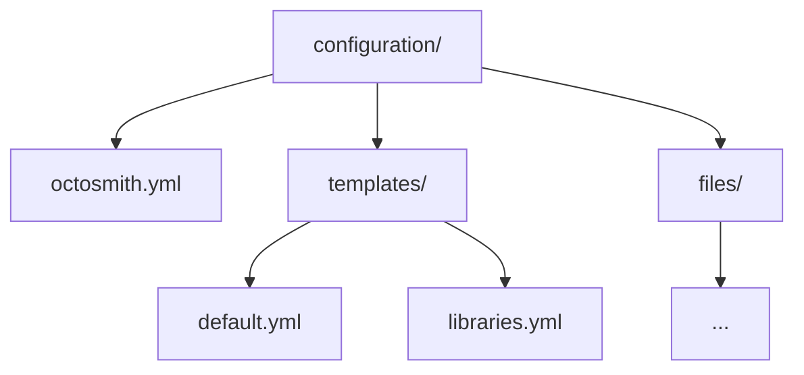

# Configuration

An Octosmith configuration directory contains one root configuration and one or
more repository templates.



## JSON Schemas

The canonical schemas live at the repository root under
[`/schemas`](../schemas/):

- `https://raw.githubusercontent.com/Kralizek/octosmith/master/schemas/octosmith.schema.json`
- `https://raw.githubusercontent.com/Kralizek/octosmith/master/schemas/template.schema.json`

For YAML editors that understand the YAML language-server directive, point each
file at the corresponding schema:

```yaml
# yaml-language-server: $schema=https://raw.githubusercontent.com/Kralizek/octosmith/master/schemas/octosmith.schema.json
```

Repository templates can use the template schema in the same way.

The published package contains generated copies so runtime validation remains
fully offline after JSR publication. The root `/schemas` files are the only
authored source; package-local copies are materialized during checks and release
packaging.

## Root configuration

`octosmith.yml` identifies the organization, repository scope, and collection
management mode.

```yaml
version: 1
organization: acme

repositories:
  scope:
    names:
      - "service-*"

  settings:
    collection_management: explicit
    unmatched_repositories: ignore
```

Repository scope may use names, teams, visibility, and custom properties. Name
selectors support `*` and `?` glob patterns.

By default, every repository discovered in scope must match exactly one
template. Set `repositories.settings.unmatched_repositories` to `ignore` to
allow a broader scope where repositories without a matching template are left
unmanaged. Repositories that match more than one template are always rejected.

## Templates

Each repository in scope that is managed must resolve to exactly one template.
When `repositories.settings.unmatched_repositories` is `ignore`, repositories
without a matching template are left unmanaged.

```yaml
kind: repository

match:
  names:
    - "service-*"

repository:
  settings:
    has_issues: true

  teams:
    - name: platform
      permission: maintain

  files:
    CODEOWNERS:
      ensure: exact
      source: files/CODEOWNERS
```

Templates can manage repository settings, teams, custom properties, Actions
settings and values, Dependabot secrets, rulesets, environments, and files.

Team permissions accept GitHub's built-in permission names. The user-facing
aliases `read` and `write` are normalized to GitHub's REST API values `pull` and
`push` respectively; custom repository-role names are preserved.

## Collection management

### explicit

`explicit` is the default. Undeclared collection members are preserved.

### strict

`strict` makes supported named collections authoritative. Undeclared members may
be removed.

Files are an exception: strict mode never infers file deletion. Deletion is
always explicit with `ensure: absent`.

## Runtime values

Variables may be read from environment variables, renamed, or declared with a
literal value.

```yaml
variables:
  - REGION
  - from: EXTERNAL_REGION
    to: REGION
  - name: STATIC_VALUE
    value: example
```

Secrets may be read or renamed but cannot be declared literally.

```yaml
secrets:
  - DEPLOY_TOKEN
  - from: SHARED_TOKEN
    to: DEPLOY_TOKEN
```

Plan does not require secret values. Apply resolves all required secret values
for a repository before mutating it.

## Managed files

Managed file sources are local to the configuration root.

```yaml
repository:
  files:
    .github/dependabot.yml:
      ensure: exact
      source: files/dependabot.yml
```

File sources must stay inside the configuration root after canonicalization,
resolve to regular files, and satisfy the configured safety limits used by
offline validation.

## Validation expectations

Configuration is schema-validated before repository discovery. Octosmith also
checks that templates cannot overlap inside configured scope and that literal
repository names in scope can resolve to a template.
