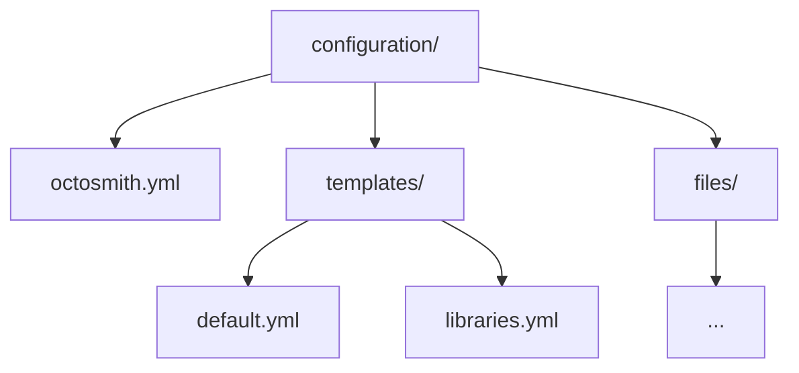

# Configuration

An Octosmith configuration directory contains one root configuration and one or
more repository templates.



## JSON Schemas

The canonical schemas live at the repository root under
[`/schemas`](../schemas/):

- `https://raw.githubusercontent.com/Kralizek/octosmith/master/schemas/octosmith.schema.json`
- `https://raw.githubusercontent.com/Kralizek/octosmith/master/schemas/template.schema.json`
- `https://raw.githubusercontent.com/Kralizek/octosmith/master/schemas/fragment.schema.json`
- `https://raw.githubusercontent.com/Kralizek/octosmith/master/schemas/plan.schema.json`

For YAML editors that understand the YAML language-server directive, point each
file at the corresponding schema:

```yaml
# yaml-language-server: $schema=https://raw.githubusercontent.com/Kralizek/octosmith/master/schemas/octosmith.schema.json
```

Repository templates can use the template schema in the same way.

The published package contains generated copies so runtime validation remains
fully offline after JSR publication. The root `/schemas` files are the only
authored source; package-local copies are materialized during checks and release
packaging.

## Root configuration

`octosmith.yml` identifies the organization, repository scope, and collection
management mode.

```yaml
version: 1
organization: acme

repositories:
  scope:
    include: all

  settings:
    collection_management: explicit
    unmatched_repositories: ignore
```

Repository scope may use names, teams, visibility, and custom properties. Name
selectors support `*` and `?` glob patterns.

`include` is required and may be either a repository selector or the literal
`all`. Use `include: all` when the scope starts from every repository and
`exclude` narrows it. `exclude` always uses the repository selector shape.

By default, every repository discovered in scope must match exactly one
template. Set `repositories.settings.unmatched_repositories` to `ignore` to
allow a broader scope where repositories without a matching template are left
unmanaged. Repositories that match more than one template are always rejected.

## Templates

Each repository in scope that is managed must resolve to exactly one template.
When `repositories.settings.unmatched_repositories` is `ignore`, repositories
without a matching template are left unmanaged.

Templates are discovered recursively under `templates/`. Their canonical
identity is `<kind>:<relative-path-without-extension>`, so
`templates/team-a/backend.yml` is `repository:team-a/backend`. The optional
`name` field is display-only and does not participate in identity.

```yaml
version: 1
kind: repository

match:
  include:
    names:
      - "service-*"

repository:
  settings:
    has_issues: true

  teams:
    - name: platform
      permission: maintain

  files:
    CODEOWNERS:
      ensure: exact
      source: files/CODEOWNERS
```

Templates can manage repository settings, teams, custom properties, Actions
settings and values, Dependabot secrets, rulesets, environments, and files.

### Fragment composition

Repository templates may compose reusable desired-state fragments with
root-level `includes`. Include paths are resolved relative to the document
declaring them, so fragments may include other fragments using paths relative to
their own location.

```yaml
version: 1
kind: repository

match:
  include:
    properties:
      type: backend

includes:
  - ../fragments/common.yml
  - ../fragments/dotnet.yml

repository: {}
```

Fragments are typed documents rather than partial templates:

```yaml
version: 1
kind: fragment
resource: repository

repository:
  settings:
    has_wiki: false
```

A fragment may contain only `includes`, which allows composition bundles. Empty
fragments are invalid. Repository templates still require their `repository`
payload; use `repository: {}` when all desired state comes from included
fragments.

Composition is deterministic. Objects merge recursively, scalar values from
later inputs replace earlier values, and arrays are replaced wholesale. Includes
are applied in declaration order and the local template is applied last.

Nested includes are limited to 32 levels and must remain within the
configuration root after path canonicalization. Cycles are rejected across the
full include chain. If the same canonical fragment is reached repeatedly while
composing one root template, it is applied only at its first depth-first
occurrence. This de-duplication is scoped per root template, so the same
fragment can be reused by multiple templates independently.

Team permissions accept GitHub's built-in permission names. The user-facing
aliases `read` and `write` are normalized to GitHub's REST API values `pull` and
`push` respectively; custom repository-role names are preserved.

## Collection management

### explicit

`explicit` is the default. Undeclared collection members are preserved.

### strict

`strict` makes supported named collections authoritative. Undeclared members may
be removed.

Files are an exception: strict mode never infers file deletion. Deletion is
always explicit with `ensure: absent`.

## Runtime values

Variables may be read from environment variables, renamed, or declared with a
literal value.

```yaml
variables:
  - REGION
  - from: EXTERNAL_REGION
    to: REGION
  - name: STATIC_VALUE
    value: example
```

Secrets may be read or renamed but cannot be declared literally.

```yaml
secrets:
  - DEPLOY_TOKEN
  - from: SHARED_TOKEN
    to: DEPLOY_TOKEN
```

`template validate` remains fully offline: it validates reference shape and
reports runtime-backed values as warnings without reading their values.

`plan` resolves variables and checks secret availability only for resources and
templates participating in the current plan. Missing required values fail that
resource before current GitHub state is read. References used only by unmatched
templates do not fail planning.

Secret values are never materialized into desired state, reports, or plans.
`apply` resolves required secrets again immediately before mutation so a future
persisted plan can be applied safely in a different runtime context.

## Managed files

Managed file sources are local to the configuration root.

```yaml
repository:
  files:
    .github/dependabot.yml:
      ensure: exact
      source: files/dependabot.yml
```

File sources must stay inside the configuration root after canonicalization,
resolve to regular files, and satisfy the configured safety limits used by
offline validation.

## Validation expectations

Configuration is schema-validated before repository discovery. Octosmith also
checks that templates cannot overlap inside configured scope and that literal
repository names in scope can resolve to a template.

## File change delivery

Managed repository files are delivered through pull requests by default.
Omitting `repositories.file_changes` is equivalent to:

```yaml
repositories:
  file_changes:
    mode: pull_request
```

When `file_changes` is present, `mode` is required. An empty object is invalid.
Pull-request settings are only valid in `pull_request` mode.

```yaml
repositories:
  file_changes:
    mode: pull_request
    commit:
      message: "Octosmith: reconcile {repository}"
    pull_request:
      branch_prefix: "octosmith/"
      title: "Octosmith: reconcile {repository}"
      labels:
        - automation
```

Use `mode: direct` to opt into writing one reconciliation commit directly to the
default branch. Commit messages and pull-request titles support `{organization}`
and `{repository}` placeholders.
