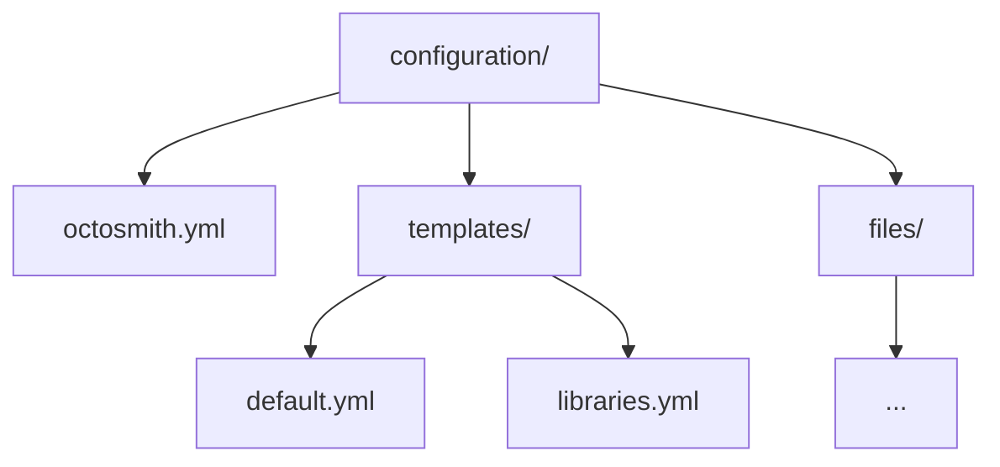

# @octosmith/octosmith

The Octosmith library package contains the configuration model, desired/current
state types, planner, reports, GitHub adapters, offline validation, and the
control-repository scaffolder.

Use this package when embedding Octosmith or when you need the configuration
model directly. For day-to-day command-line usage, use
[`@octosmith/cli`](../cli/README.md).

## Import

```ts
import {
  buildPlan,
  loadConfigurationDirectory,
  validateConfigurationDirectory,
} from "jsr:@octosmith/octosmith@0";
```

For example, validate a configuration directory without accessing GitHub:

```ts
await validateConfigurationDirectory("./configuration");
```

For deeper guidance, see the repository documentation for
[configuration](../../docs/configuration.md) and
[architecture](../../docs/architecture.md).

Canonical JSON Schemas for configuration authors are published from the
repository [`/schemas`](../../schemas/) directory. See the
[configuration guide](../../docs/configuration.md) for editor integration.

## Configuration model

An Octosmith configuration directory has one root file and one or more
repository templates:



### Root configuration

`octosmith.yml` identifies the organization, repository scope, and collection
management behavior:

```yaml
version: 1
organization: acme

repositories:
  scope:
    include:
      names:
        - "service-*"

  settings:
    collection_management: explicit
```

Repository scope requires an `include` selector and may define an `exclude`
selector with the same shape. Matching is `include AND NOT exclude`. Selectors
can use repository names, teams, visibility, and custom properties. Name
selectors support `*` and `?` glob patterns.

### Repository templates

Every repository in scope must resolve to exactly one template. Templates are
discovered recursively and identified as
`<kind>:<relative-path-without-extension>`. The optional `name` is display-only.

Example:

```yaml
version: 1
kind: repository

match:
  include:
    names:
      - "service-*"

repository:
  settings:
    has_issues: true

  teams:
    - name: platform
      permission: maintain

  files:
    .github/dependabot.yml:
      ensure: exact
      source: files/dependabot.yml
```

Template `match` uses the same required `include` and optional `exclude`
structure. An exclusion applies only to that template.

A repository template can manage:

- repository settings
- teams and permissions
- custom properties
- GitHub Actions settings, variables, and secrets
- Dependabot secrets
- rulesets
- environments
- managed files

Configuration and templates are schema-validated before GitHub discovery.

## Collection management

`repositories.settings.collection_management` controls how supported named
collections are interpreted.

### explicit

`explicit` is the default. Only declared members are managed; undeclared members
are preserved.

```yaml
repositories:
  settings:
    collection_management: explicit
```

### strict

`strict` makes supported managed collections authoritative. Undeclared members
can therefore be removed.

```yaml
repositories:
  settings:
    collection_management: strict
```

Managed files are intentionally different: strict mode never infers file
deletion. A file is deleted only when it is explicitly configured with
`ensure: absent`.

## Runtime values and secrets

Variables may come from the process environment, be renamed, or use literal
configuration values:

```yaml
variables:
  - REGION
  - from: EXTERNAL_REGION
    to: REGION
  - name: STATIC_VALUE
    value: example
```

Secrets support environment lookup and renaming, but not literal values:

```yaml
secrets:
  - DEPLOY_TOKEN
  - from: SHARED_TOKEN
    to: DEPLOY_TOKEN
```

Secret values are not stored in configuration or reports. Before mutating a
repository, Octosmith resolves the secret values required by that repository; if
one is missing, that repository is not partially mutated first.

Plan mode does not require secret values.

## Managed files

For `ensure: exact` or `ensure: exists`, `source` is a local file relative to
the configuration root.

```yaml
repository:
  files:
    CODEOWNERS:
      ensure: exact
      source: files/CODEOWNERS
```

Source files are confined to the configuration root and are bounded during
loading so offline validation can safely process untrusted pull-request
configuration.

## Main API areas

The package's default export surface includes:

- configuration loading and offline validation
- selector matching and desired-state resolution
- desired/current state models
- plan construction and operation types
- structured reports and text rendering
- GitHub discovery and state readers
- GitHub mutation sinks and apply helpers

The package intentionally contains the reusable engine. CLI argument parsing,
console output selection, and Hooksmith event serialization live in
`@octosmith/cli`.

## Scaffold a control repository

The package also exposes `./create` for `deno create`:

```sh
deno create jsr:@octosmith/octosmith@0 github-config -- --organization acme
```

Useful options are:

- `--collection-management <explicit|strict>`
- `--default-branch <name>`
- `--no-workflows`
- `--event-streaming`

The generated repository starts scoped to itself so the initial apply cannot
unexpectedly manage an entire organization.
